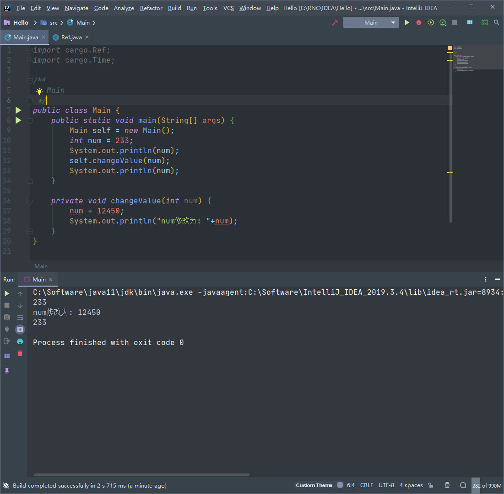
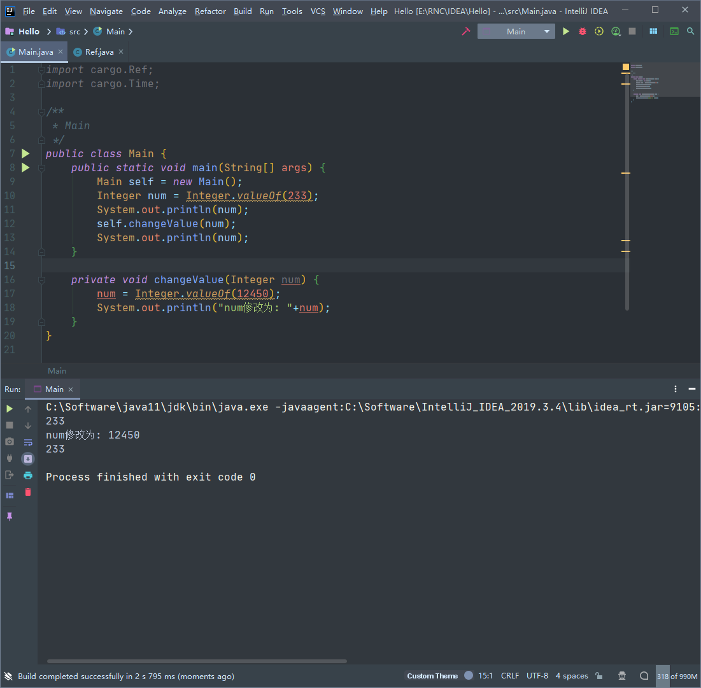
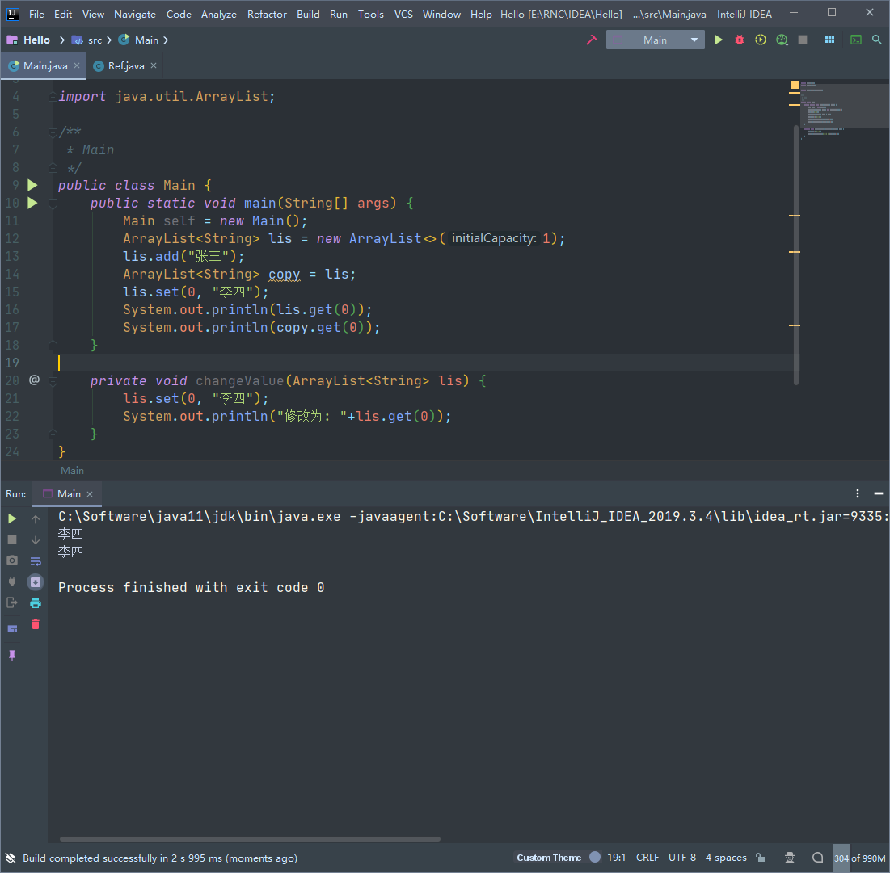
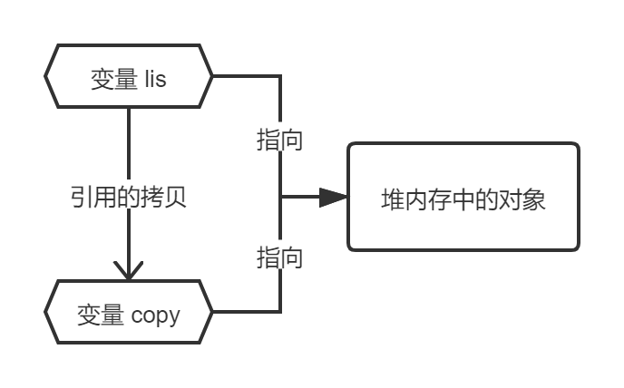
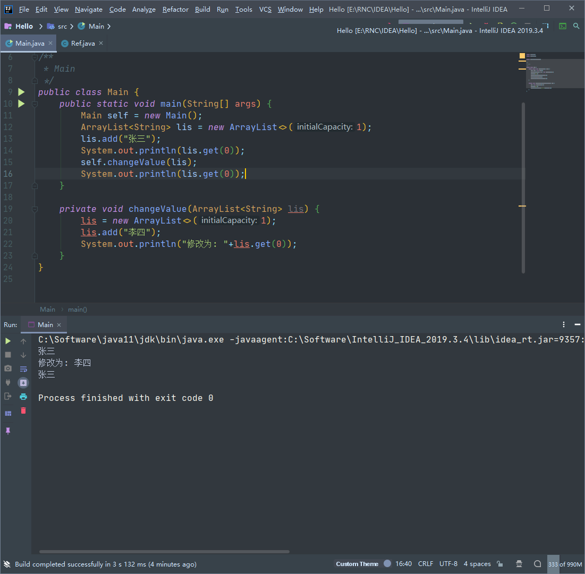

进入正题之前先简单说说**值传递**和**引用传递**的区别

> 按值调用(call by value)表示方法接收的是调用者提供的值，而按引用调用(call by reference)表示方法接收的是调用者提供的变量地址。一个方法可以修改传递引用所对应的变量值，而不能修改传递值调用所对应的变量值。

下面是我用[Rust](https://www.rust-lang.org/)来做的一个简单示范。

可以看到，虽然`call_by_value`函数和`call_by_reference`函数都将接收到的参数的值修改为了`12450`，但是由于`call_by_reference`函数接收的是`by_ref`变量的引用，所以在函数内修改`by_ref`的值会影响到函数外部的`by_ref`变量，而`call_by_value`函数接收的是`by_val`变量的值，所以在函数内修改`by_val`的值不会影响到函数外部的`by_val`变量。

<!-- more -->

# 对于基本数据类型, Java是值传递还是引用传递?

看下图

可以看到，在函数内的修改并没有影响到函数外部的`num`，所以对于基本数据类型, Java是值传递

对于基本数据的包装类, 也是值传递

# 对于引用类型, Java是值传递还是引用传递?

看下图

可以看到，在函数内的修改已经影响到了函数外部的`lis`，这似乎证明了对于引用类型, Java是引用传递

**但是**, 我们都知道, 对于引用类型, 变量保存的是指向其堆内存的地址, 也就是说, 如果将引用类型赋值给另一个变量, 修改当前变量的值, 另一个变量也会被改变, 如何理解呢? 请看下图

可以看到, 虽然只是修改了`lis`而没有去修改`copy`, 但由于`lis`和`copy`指向的是同一内存地址, 所以对`lis`的修改也会体现在`copy`上

回到正题，既然知道了`lis`变量是对于堆内存中ArrayList的引用, 那么之前的结果就不成立了, 修改`changeValue`方法再看

可以看到, 在函数中将一个新的ArrayList的引用赋值给了`lis`变量, 但是函数外的`lis`变量依然指向的是原来的ArrayList, 所以得出结论, 对于引用类型, Java也是值传递

# 结论
无论是对于基本数据类型还是引用类型，Java都是**值传递**，但要注意的是，对于引用类型，变量保存的是其引用，所以通过函数接收的变量去修改其指向的引用类型，也**会影响到函数外的变量**，而给函数接收的变量赋予新的引用，则**不会影响到函数外的变量**。
