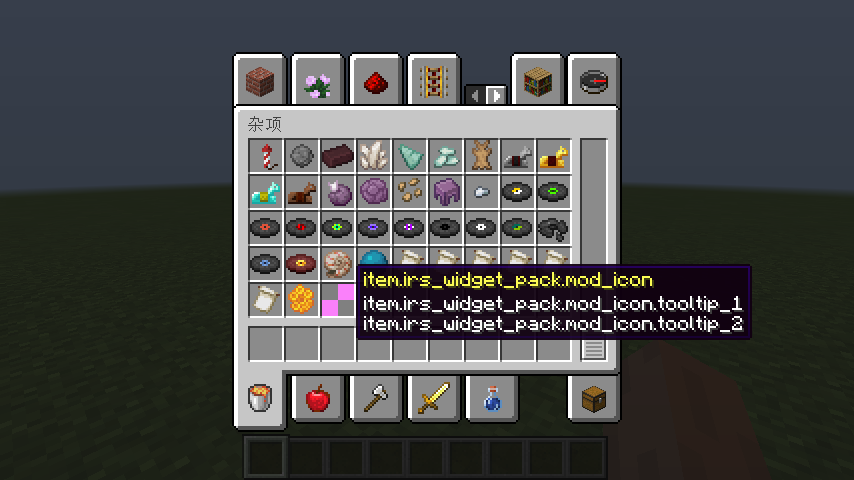
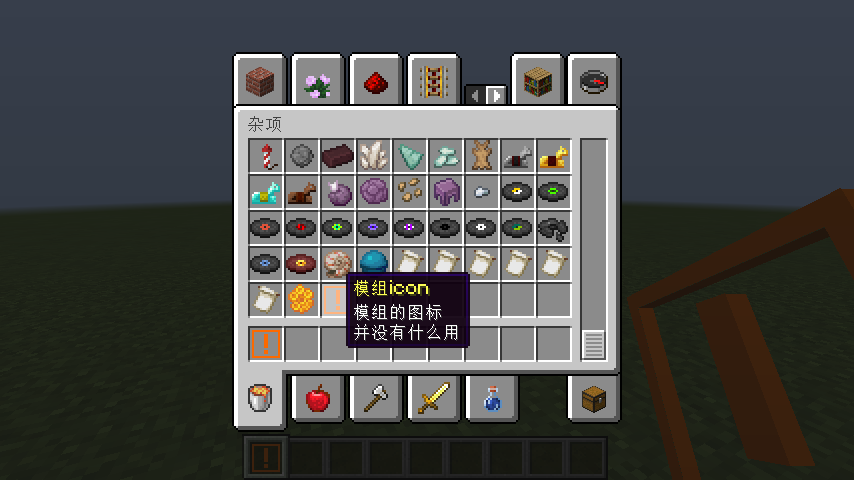

# 向Minecraft中添加物品
## 定位入口
找到`fabric.mod.json` 文件中`entrypoints.main` 键所对应的类
```javascript
{
  // ...
  "entrypoints": {
    "main": [
      "com.ilirus.widget.pack.WidgetPackKt::init"
    ]
  },
  // ...
}
```
我这里的值是`com.ilirus.widget.pack.WidgetPackKt::init`，说明`com.ilirus.widget.pack` 包下`WidgetPack.kt` 类中的`init` 方法是Mod的入口

`WidgetPack.kt`
```kotlin
@Suppress("unused")
fun init() {
  println("Hello Minecraft!")
}
```
可以看到`init` 方法里面什么都没有，不过这个类之后会用到，所以先记下来

<!-- more -->

## 新建物品
新建一个`class`，继承`net.minecraft.item.Item` 类，`Item`类的构造器接收一个参数类型为`Settings` 类的参数，这个`Settings` 类是`Item` 的内部类。

`Settings` 类可以对`Item` 的属性进行配置。
```kotlin
class ModIcon(settings: Settings) : Item(settings) {
  companion object {
    val settings: Settings = Settings()
        // 物品分组, 配置物品出现在创造模式物品栏的哪一个选项卡中
        .group(ItemGroup.MISC)
        // 此物品作为合成材料参与合成后返回的物品,
        // 比如牛奶桶参与合成后会返回铁桶
        // .recipeRemainder(Items.HONEYCOMB)
        // 稀有度 (物品名的颜色)
        .rarity(Rarity.UNCOMMON)
        // 食物属性, 设置后该物品即可食用, 属性依照传入的参数
        // .food(FoodComponent)
        // 设置物品防火，扔到火焰和岩浆里不会被烧掉(仙人掌依然能破环该物品)
        .fireproof()
        // 设置最大堆叠数量，默认64
        .maxCount(64)
        // 设置物品耐久度，默认0，不为0时则该物品不可堆叠
        // 调用该方法会将最大堆叠数设为1
        .maxDamage(1024)

    // 保存实例
    @JvmStatic
    val INSTANCE = ModIcon(settings)
  }

  // 添加工具提示
  override fun appendTooltip(stack: ItemStack?, world: World?, tooltip: MutableList<Text>?, context: TooltipContext?) {
    // 参数格式一般为"物品类型.命名空间.物品名称.tooltip+序号"
    tooltip?.add(TranslatableText("item.irs_widget_pack.mod_icon.tooltip_1"))
    tooltip?.add(TranslatableText("item.irs_widget_pack.mod_icon.tooltip_2"))
  }
}
```

## 注册物品
配置完成物品后，还需要进行物品的注册。
```kotlin
@Suppress("unused")
fun init() {
  // 创建物品标识，第一个参数为物品的注册的命名空间，原版物品的命名空间为"minecraft"，
  // 第二个参数为物品的注册名称
  val identifier: Identifier = Identifier("irs_widget_pack", "mod_icon")
  // 注册物品，第一个参数为物品类型，第二个参数为物品标识，第三个参数为物品类实例
  Registry.register(Registry.ITEM, identifier, ModIcon.INSTANCE)
}
```

之后运行runClient 启动Minecraft，在创造模式的杂项选项卡中，即可看到我们添加的物品


可以看到，虽然物品添加成功了，但是没有材质和名称，接下来我们就为其添加名称和材质。

## 添加材质
在`resources/assets/<你的Mod注册的命名空间>/textures/item` 文件夹下，创建一个与你添加物品同名的`png` 文件。

已我添加的物品为例，我在Identifier中注册的命名空间是irs_widget_pack ，物品名称是mod_icon 所以我需要在`resources/assets/irs_widget_pack/textures/item` 文件夹下新建`mod_icon.png` 文件，这个png文件就是物品的材质了。

但是还没完，我们仅仅是新建了材质文件，接下了还要告诉Minecraft如何渲染材质。

在`resources/assets/<你的Mod注册的命名空间>/models/item` 文件夹下，创建一个与你添加物品同名的`json` 文件。

同样以我添加的物品为例，路径为`resources/assets/irs_widget_pack/models/item`，文件名为`mod_icon.json`。

```javascript
{
  // 标明类型为物品
  "parent": "item/generated",
  "textures": {
    // 标明材质文件为irs_widget_pack命名空间中, item种类里, 名称为mod_icon的文件
    "layer0": "irs_widget_pack:item/mod_icon"
  }
}
```

## 添加名称
之前提到我们添加的物品没有名称，其实并不是，物品名称在我们用`Registry.register()` 方法注册物品时就已经有了，其格式为"物品类型.命名空间.物品名称"，我们现在要做的就是添加翻译文件，将游戏内部使用的物品名称翻译为用户所需要的名称。

在`resources/assets/irs_widget_pack/lang` 文件夹下新增对应语言的翻译文件，Minecraft会根据你在游戏中设置的语言选项，自动寻找对应的语言文件，如果使用简体中文，则新建`zh_cn.json` 文件。

Minecraft在找不到对应语言的翻译文件时，会默认使用`en_us.json` 文件，所以你除了新建`zh_cn.json` 文件以外，还要新建`en_us.json` 文件。

或者你可以选择不新建`zh_cn.json` 文件，直接创建使用`en_us.json` 文件。

在你创建的文件中写入以下内容
```javascript
{
  // 物品名称
  "item.irs_widget_pack.mod_icon": "模组icon",
  // 物品的工具提示
  "item.irs_widget_pack.mod_icon.tooltip_1": "模组的图标",
  "item.irs_widget_pack.mod_icon.tooltip_2": "并没有什么用"
}
```

再重新启动游戏，可以看到效果

