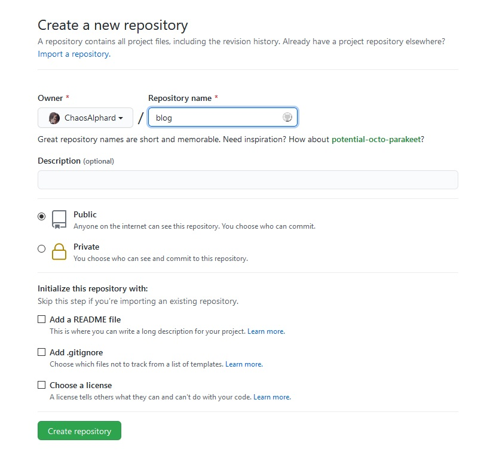
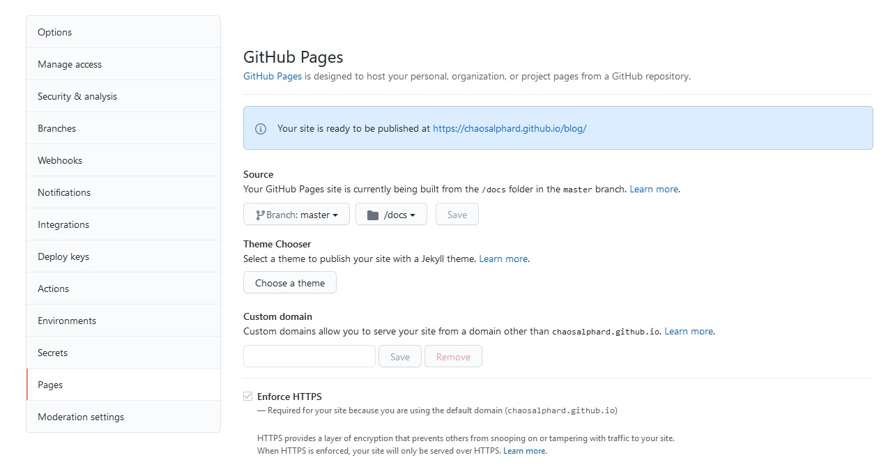
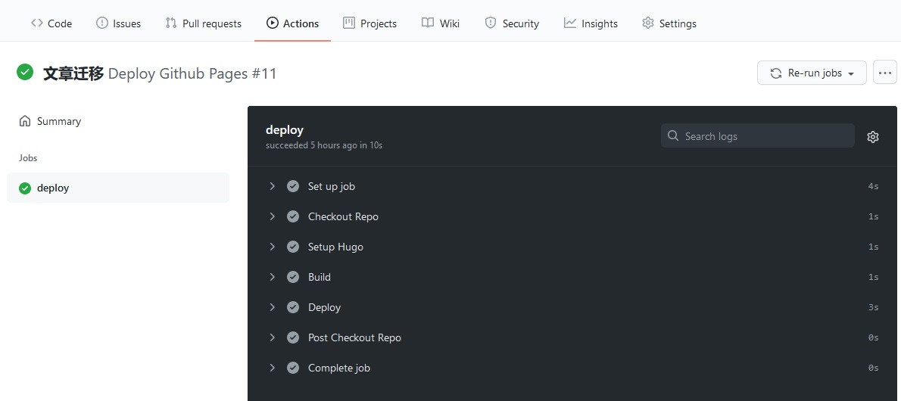

近期我部署在Gitee上的博客已经不能用了, 虽然还能上传, 但是已经不会把上传的文章更新出来了, 故迁移到Github上, 顺便Hexo文章生成速度不太理想, 趁着这次部署站点迁移一并切换到Hugo.

# 搭建Hugo写作环境
## Hugo下载
首先从[Hugo](https://gohugo.io/)官网下载适合自己电脑环境的Hugo版本。

下载地址：[https://github.com/gohugoio/hugo/releases](https://github.com/gohugoio/hugo/releases)

将解压出来的`Hugo.exe` 添加到环境变量中。

## 创建Github Pages 仓库
进入[Github](https://github.com/new)网站，点击New Repositories 按钮，新建一个仓库，名称我这里选blog，访问类型选择Public


创建完成后点击Settings选项，选择Pages，Branch选择master，目录选择/docs，之后点击save按钮，即可看到上方蓝色提示：Your site is ready to be published at `https://chaosalphard.github.io/blog`，这个地址便是Github给你分配的博客地址，如果你有自己的域名的话可以在这里绑定。


## 初始化Hugo站点
将刚才创建的Git 仓库Clone 到本地，打开命令行，切换到刚才Clone 下来的仓库的文件夹里面，此时文件夹里面应该除了一个名为.git的隐藏文件夹之外没有其他文件了，执行`hugo new site . --force` 来初始化hugo站点。

之后选择一款自己喜欢的主题，地址：[https://themes.gohugo.io](https://themes.gohugo.io)，下载或者Clone 到本地，将文件夹放到hugo站点的根目录下。

编辑`config.toml`|`config.yaml`|`config.json` 配置文件，修改`baseurl` 为Github 分配的博客地址，修改`theme` 为你的主题文件夹名称。

## 创建文章

切换到hugo站点目录，执行`hugo new post/article.md` 来新建一篇名为article 的文章，文件位于`/content/post` 目录下，打开文件进行编辑，因为我之前用Hexo的时候已经有一些文章了，所以我直接复制过来，Hexo和Hugo都支持markdown语法编写的文章，所以可以直接切换。

# 部署到GitHubPages
## 本地调试

切换到hugo站点目录，执行`hugo server -D`，此时会输出以下信息
```text
~/Hugo/blog> hugo server -D
Start building sites …
                   | ZH-CN
-------------------+--------
  Pages            |   182
  Paginator pages  |    20
  Non-page files   |     4
  Static files     |     0
  Processed images |    13
  Aliases          |    61
  Sitemaps         |     1
  Cleaned          |     0

Built in 3795 ms
Watching for changes in ~/Hugo/blog/{archetypes,assets,content,data,layouts,static,themes}
Watching for config changes in ~/Hugo/blog/config.yaml
Environment: "development"
Serving pages from memory
Running in Fast Render Mode. For full rebuilds on change: hugo server --disableFastRender
Web Server is available at http://localhost:1313/blog/ (bind address 127.0.0.1)
Press Ctrl+C to stop
```
根据提示打开网址 (我这里是http://localhost:1313/blog/) 即可看到文章，确认无误后即可部署到GithubPages上。

## 生成文件并部署到GithubPages上

切换到hugo站点目录下，执行`hugo -d docs`，即可在`/docs` 目录下生成部署文件，之后将所有改动从本地提交到远程Git仓库上 (或者仅提交/docs目录下文件也可以)。

# 配置GithubAction完成云端构建
## 创建Action配置文件
在hugo站点目录下新建`.github/workflows` 目录，在此目录下新建`gh-pages.yaml` 文件并写入以下内容。
```yaml
# Action名称
name: Deploy Github Pages
on:
  push:
    branches:
      # 在master分支被push时触发
      - master
jobs:
  deploy:
    runs-on: ubuntu-20.04
    # 设置执行环境
    environment:
      name: github-pages
    # 步骤
    steps:
      # 检出
      - name: Checkout Repo
        uses: actions/checkout@v2
        with:
          submodules: true
          fetch-depth: 0
      # 初始化Hugo
      - name: Setup Hugo
        uses: peaceiris/actions-hugo@v2
        with:
          hugo-version: '0.83.1'
          extended: true
      # 生成部署文件
      - name: Build
        run: hugo --gc --minify --cleanDestinationDir
      # 部署到GithubPages
      - name: Deploy
        uses: peaceiris/actions-gh-pages@v3
        with:
          # ACTIONS_DEPLOY_KEY需要在仓库里进行配置
          deploy_key: ${{ secrets.ACTIONS_DEPLOY_KEY }}
          force_orphan: true
          # 设置使用gh-pages分支来存放部署文件, 一般master分支存放原始文件, gh-pages分支存放部署文件
          publish_branch: gh-pages
          # hugo生成的部署文件默认放在public目录中, 这里是指定推送public目录中的文件到gh-pages分支中
          publish_dir: ./public
          # 排除文件不推送到gh-pages分支中
          exclude_assets: '.github'
          user_name: 'github-actions[bot]'
          user_email: 'github-actions[bot]@chaosalphard.noreply.github.com'
          commit_message: ${{ github.event.head_commit.message }}
```
其他更多设置请查看[actions-hugo](https://github.com/peaceiris/actions-hugo)和[actions-gh-pages](https://github.com/peaceiris/actions-gh-pages)插件说明

## 生成部署密钥
执行`ssh-keygen -t rsa -b 4096 -C "$(git config user.email)" -f gh-pages -N ""` 指令生成一对公钥(`gh-pages.pub`)和私钥(`gh-pages`)

进入Github Pages仓库，点击Settings 选项，选择`Deploy keys`，新建一个Deploy key，将刚才生成的公钥文件的内容复制进来，勾选`Allow write access` 选项，然后保存。

点击Environments 选项，新建一个Environments 名称填`github-pages` (需要与`gh-pages.yaml` 文件中设置的environment name 一致)，之后在github-pages 下新建一个secret，名称填`ACTIONS_DEPLOY_KEY` (需要与`gh-pages.yaml` 文件中设置的deploy_key 对应)，将刚才生成的私钥文件的内容复制过来，然后保存。

## 测试Action部署

回到Hugo站点目录，将/docs目录删除，因为我们现在不需要在本地生成部署文件了，之后提交到Github Pages仓库，然后去Github Pages仓库的Action 选项，查看任务是否执行成功。


如果没有成功，回到Settings 选项下的Pages 页面，将Branch 更改为`gh-pages`，目录选择`/`，保存，然后回到Action 页面，点击Re-run jobs，稍等一会即可看到结果。
